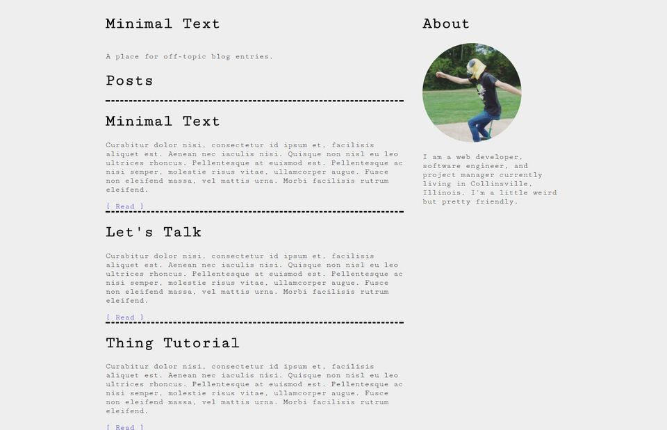

# Minimal Text

Minimal Text is a clean and lightweight Jekyll Theme

## Documentation

__Baseurl__

```yaml
---
title: Minimal Text
baseurl: "/Minimal-Text"
```
The site baseurl is prepended to asset links and the home button in the `post.html` layout. Please note it must start with a "/"
By changing this you are changing the location of your website. gh.clarkhacks.com`/Minimal-Text` is the location of Minimal-Text in my case.

__Pagination__

```yaml
paginate: 5
paginate_path: "/:num/"
```
`paginate` in `_config.yml` is the number of post blocks that will appear on a single page.
`paginate_path` is at what location your blog pages will be displayed.

__The documentation has been implemented because of user questions.__ For more documentation to be please request what you need defined.


